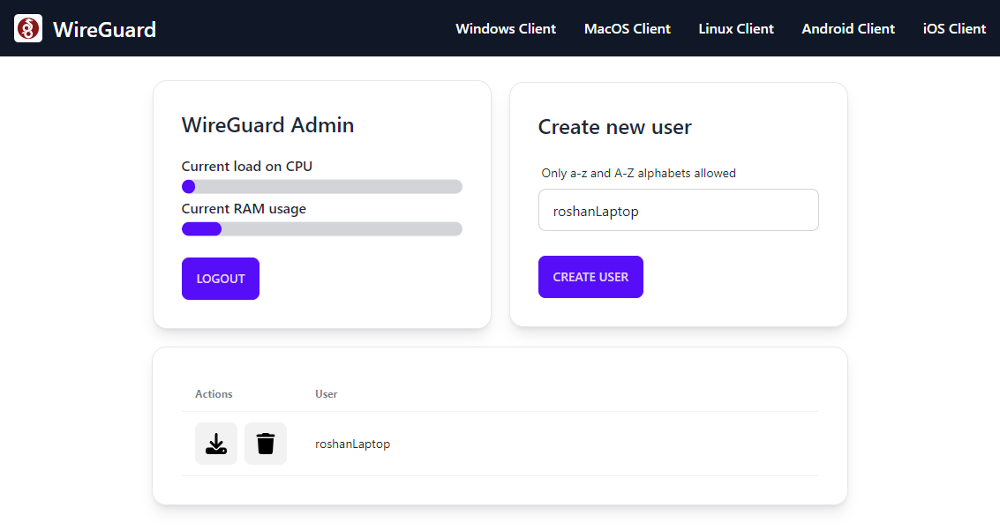

# OpenVPN • WireGuard

Install OpenVPN or WireGuard along with a web admin panel on a freshly created virtual machine using just a single line of command.

```bash
sudo wget https://raw.githubusercontent.com/dashroshan/openvpn-wireguard-admin/main/setup.sh -O setup.sh && sudo chmod +x setup.sh && sudo bash setup.sh
```

### Prerequisites

-   Open port 80, 443, and whichever port you want to use for the VPN in your VM hosting network panel.
-   Create a domain pointing to your VM for the web admin panel.

### Admin panel



### Credits

This project uses the easy install scripts by [Nyr](https://github.com/Nyr) for setting up the OpenVPN and WireGuard services.